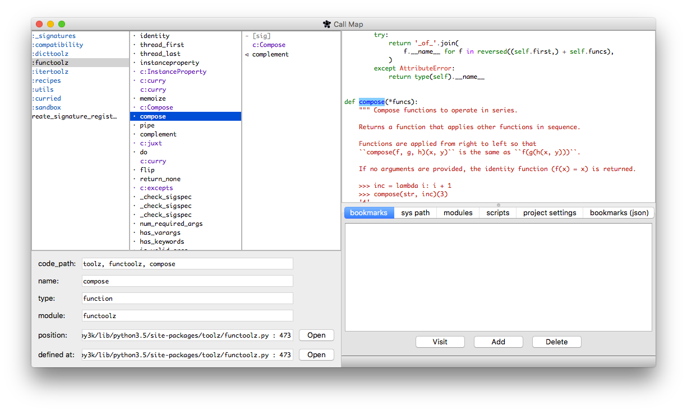

==========
 Call Map
==========

.. default-role:: code

About
======

Call Map is a tool for navigating call graphs in Python, with plans to support
other languages. Below is a screen shot after running `call_map -m toolz`, then
clicking on some functions.

While Call Map is intended to help in gaining a general
understanding of a codebase, it is also a natural fit for tracing code paths,
which constitutes an important security concern. Many security issues are
revealed by finding a code path that connects user input to dangerous coding
patterns.

See the `blog post`__ for more.

__ https://www.nccgroup.trust/us/about-us/newsroom-and-events/blog/2017/july/call-map-a-tool-for-navigating-call-graphs-in-python/

Installation
=============

Call Map is distributed as a python package for `Python 3.5`. To install with
`pip3`, run::

  # From top level directory of call_map
  pip3 install -e .

Note that some Python 3 distributions call the package manager `pip`, and some
call it `pip3`, so you may need substitute `pip3` with `pip`.

The above commands should install the executable `call_map` to the same path
that the Python interpreter is in.

For details and alternative methods see `INSTALL.rst`.

Quick Start
============

Open files to start exploring::

  call_map -f example.py

  # you can also open multiple files
  call_map -f *.py

You can also add to the module search path (`sys.path`)::

  call_map -f *.py -p .

Call Map will try to resolve the files as modules whenever they can be found in
the module search path. For more documentation on command line
arguments, `call_map -h`.

Configuration
=============

To configure Call Map, set the environment variable CALL_MAP_RC_DIRECTORY.
The path to the Call Map configuration file will be::

  $CALL_MAP_RC_DIRECTORY/call_map_rc.py

At this time the configuration options are:

- `open_in_editor(path: pathlib.Path, line: int)`: if you define this function
  it will be called whenever you open a file. For example, the following can be
  used to open files in an Emacs server if have you called `server-mode` in a
  running Emacs session::

    def open_in_editor(path, line):
        import subprocess as sbp
        sbp.call(['emacsclient', '+{}'.format(line), str(path)])

  The following can be used to open files in the GVim server if you started a GVim
  server with `gvim --servername my_vim_server`::

    def open_in_editor(path, line):
        import subprocess as sbp
        sbp.call(['gvim', '--servername', 'my_vim_server', '--remote', '+{}'.format(line), str(path)])

- `MULTITHREADING`: Whether to use a separate thread for the GUI and searching
  the call graph. Defaults to `True`. Turning it off is for debug purposes.

Quirks
=======

There are a couple of quirks in the UI design, due to the fact that I haven't
arrived at a better solution or the tradeoff of additional complexity is
unfavorable.

- Usages can appear to show up more than once, but actually they are different
  usages in the same scope.

- You may notice some bulitins such as `help`, `id`, and `filter` are ignored.
  See `call_map/config.py` in the source code for the full list of ignored
  functions.

- If the position to be highlighted is at the start of a file, it won't be
  highlighted. This is because typically only modules and scripts are positioned
  at the start of their respective files.

Quirks Inherited from Jedi 
---------------------------

Some quirks are inherited from the `jedi` Python analysis backend.

- The search scope for usages is the set of modules that have been loaded by the
  `jedi` backend. That means that the scope will change as you explore new
  modules. If you want to explicitly include a module in the search scope, add
  it to the initial list of modules to be inspected.

- `jedi` always searches the interpreter's `sys.path`, even when it is not
  explicitly included. However, it will prioritize the user-defined `sys_path`.

Caveats
========

Any caveats that exist for static analysis backends also apply to Call Map. (At
this time only the `jedi` backend is integrated into Call Map.)

Jedi
-----

The `jedi` backend for Python analysis does not always find all usages. The
dynamic nature of Python makes it impossible to always determine the definition
of a function with static analysis. Sometimes `jedi` resolves a call to multiple
possible functions. For example `os.path.abspath` depends on the platform. In
this case `call_map` lists both possibilities as `abspath` and `abspath (2)`.
`jedi` also does not resolve all calls and usages. Jedi's own documentation also
has a `list of caveats`__.

Sometimes when Jedi throws an error when analyzing one item, the error affects
other items. For example, when finding usages, if Jedi raises an error on one
usage, the other usages it has found may be unrecoverable (as of Jedi v0.10.0).

__ https://jedi.readthedocs.io/en/latest/docs/features.html#caveats
